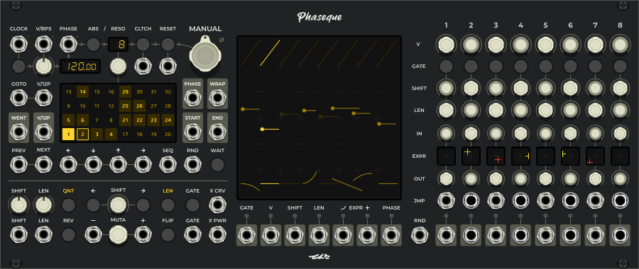
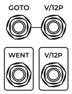

<!---
start: simple
-->

# Phaseque

  

> Секвенсор, управляемый фазой

Phaseque - это секвенсор, который изначально разрабатывался с двумя идеями - решить проблемы, вызванные ограничениями классических секвенсоров и добавить что-нибудь интересное. Например, часто бывает так, что при создании секвенции вдруг становится ясно, что сильная доля оказалсь не на первом шаге паттерна, Phaseque легко позволяет сместить весь паттерн по фазе на необходимую величину. Помимо этого он позволяет делать ещё много других вещей, необычных для большинства секвенсоров.

## Быстрый старт

Чтобы заставить Phaseque играть, ему нужно дать один из трёх вариантов информации о транспорте в вашем проекте - классический клок (импульсы), фазу (пила в диапазоне 0V - 10V) или V/BPS и включить сцепление ([CLTCH](#controls-cltch)):

Когда сцепление включено, выход [Gate](#outputs-gate) становится активным. Остальные выходы с информацией о шагах секвенции работают постоянно, в том числе, выход [V](#outputs-v), являющийся аналогом питча в классических секвенсорах:

## Секция привода

Как было сказано выше, Phaseque поддерживает разные виды информации о транспорте, но его основная особенность в поддержке положения транспорта между ударами долей.

### Классический импульсный клок

В этом режиме Phaseque пытается подстроиться под темп импульсов, поступающих на вход [Clock](#inputs-clock) если включена [автоподстройка](#controls-auto-sync). Если же она отключена, то он будет проигрывать часть паттерна с заданным темпом, а потом дожидаться следующего импульса. Этот темп задаётся при помощи [регулятора](#controls-bpm) и может быть переопределён при помощи входа [V/BPS](#inputs-vbps).

### V/BPS

Упомянутый выше вход [V/BPS](#inputs-vbps) так же может использоваться для привода секвенсора в движение. V/BPS это абсолютное значение, вольты на удары в секунду, то есть, 2 вольта - это темп два удара в секунду (или 120 BPM). Немного больше об этом написано в [руководстве модуля Clock](./clock).

### Фазовый клок

Фазовый транспорт является самым наглядным в Phaseque. Диапазон входа [PHASE](#inputs-phase) - от 0V до 10V. Для обычной работы в качестве сигнала с фазой выступает пилообразная волна, каждый период которой заставляет секвенсор пройти через очередную фазу паттерна. Эти участки обозначены на главном дисплее:

#### Абсолютный режим

При использовании входа фазы становится полезным режим абсолютной фазы включаемый переключателем [ABS](#controls-abs). В этом режиме один период растягивается на весь паттерн, отключаются механизмы угадывания истинной фазы транспорта и секвенсор встаёт ровно в то место паттерна, которое соответствует текущему значению на входе [PHASE](#inputs-phase). В абсолютном режиме Phaseque можно превратить в надстройку над пилообразным VCO.

### Разрешение паттерна

Каждый паттерн в Phaseque (а их в нём может храниться 32 штуки) имеет собственное разрешение (Resolution, "Reso"), отображаемое на [дисплее](#indicators-resolution) и регулируемое [энкодером](#controls-resolution). С помощью разрешения можно указать, с какой скоростью проигрывается паттерн - чем больше разрешение, тем больше импульсов клока или периодов фазы нужно, чтобы проиграть его от начала до конца. Можно легко создавать необычные ритмические рисунки, используя комбинации из нескольких паттернов с разными разрешениями, сумма которых составляет желаемую протяжённость комбинации.

### Сцепление и сброс

Привод и проигрывание паттерна в Phaseque не связаны жёстко, в любой момент можно отключить сцепление ([CLTCH](#controls-clutch)) и проигрывание паттерна прекратится, а так же отключится выход [GATE](#outputs-gate). Кнопка [RESET](#controls-reset) производит сброс паттерна к стартовой позиции, которая может быть отрегулирована при помощи энкодера [MANUAL](#controls-manual).

## Навигация по сетке паттернов

Phaseque имеет память на 32 паттерна и широкие возможности по переключению между ними и отслеживанию этих переключений. На сетке не пустые паттерны отмечаются слабой подстветкой, текущий паттерн - яркой подстветкой, а запланированный паттерн имеет яркую обводку (об этом чуть позже). Слева от сетки паттернов находится секция абсолютной навигации, снизу - ряд входов относительной навигации и справа - выходы с информацией о перемещении по паттерну.

### Абсолютная навигация

Вход [V/12P](#inputs-v12p) работает по аналогии с CV входами, предназначенными для выражения музыкальных нот с помощью CV, но здесь вместо нот - номера паттернов. Каждое повышение напряжения на 1/12 вольта эквивалентно 1 паттерну. Вход [GOTO](#inputs-goto) принимает импульсы, которые заставляют секвенсор переключиться на паттерн, соответствующий текущему напряжению на входе [V/12P](#inputs-v12p).

>Если вход [V/12P](#inputs-v12p) не подключен, то триггеры на входе [GOTO](#inputs-goto) будут возвращать секвенсор на первый паттерн.

По аналогии со входом [V/12P](#inputs-v12p), выход [V/12P](#outputs-v12p) сообщает о номере текущего паттерна, а выход [WENT](#outputs-went) сигнализирует в виде триггера о произошедшем переходе секвенсора на этот паттерн.

>С помощью входов и выходов абсолютной навигации можно соединять несколько модулей Phaseque друг с другом и синхронизировать их переходы между паттернами.

### Относительная навигация

Все входы относительной навигации переключаются только между не пустыми паттернами, то есть, игнорируя те паттерны, в которых не было сделано никаких изменений. Исключением является вход [SEQ](#inputs-seq).

[PREV](#inputs-prev) и [NEXT](#inputs-next) переходят к предыдущему или следующему по порядку номеров паттерну. Если в выбранном направлении больше нет не пустых паттернов, то поиск цели происходит по кругу.

[←](#inputs-left), [↓](#inputs-down), [↑](#inputs-up), [→](#inputs-right) - входы для перемещения по сетке в определённом направлении. Как и два предыдущих входа, они переключают секвенсор только на ближайший не пустой паттерн в выбранном направлении. При этом сетка паттернов разделена на два квадрата и правый квадрат является продолжением верхней части левого квадрата. То есть, если начать переключаться вправо с первого паттерна, то порядок будет таким: 1 → 2 → 3 → 4 → 1, а если начать переключаться вверх, то 1 ↑ 5 ↑ 9 ↑ 13 ↑ 17 ↑ 21 ↑ 25 ↑ 29 ↑ 1.

[SEQ](#inputs-seq) - переход на запланированный паттерн. Для каждого паттерна в сетке можно запланировать следующий паттерн, на который секвенсор переключится при получении триггера на входе [SEQ](#inputs-seq). Это можно сделать кликом правой кнопкой мыши по сетке паттернов.

[RND](#inputs-rnd) - переход на случайный не пустой паттерн.

[WAIT](#controls-wait) - блокировка переключения паттернов. Может применяться в процессе редактирования паттерна, чтобы не повредить соседние паттерны при неожиданном переключении секвенсора на них.

### Информация о навигации

Phaseque сообщает о прогрессе воспроизведения текущего паттерна.
* Он выдаёт текущую фазу на выходе [PHASE](#outputs-pattern-phase).
* Он генерирует триггер на выходах [END](#outputs-end) и [START](#outputs-start) когда паттерн доиграв до конца или начала (в случае реверса) начинает проигрываться заново. Выход [WRAP](#outputs-wrap) выдаёт триггер как в первом, так и во втором случае.

## Трансформация паттерна

Над паттернами в Phaseque можно производить различные деструктивные и недеструктивные трансформации.

Регуляторы [SHIFT](#controls-global-shift) и [LEN](#controls-global-len) позволяют динамически регулировать сдвиг по фазе и длину шагов паттерна с возможностью управления через CV. Сдвиг регулируется в пределах +/- 1/8 от длины паттерна при помощи регулятора и ещё на столько же при помощи CV. Длина шагов может быть увеличена максимум в 2 раза при помощи регулятора [LEN](#controls-global-len) и ещё в 2 раза при помощи CV.

Кнопки [QNT](#controls-pattern-qnt) и [LEN](#controls-pattern-len) производят квантизацию старта и длины шагов к сетке размерностью 1/16 от длины паттерна.

Кнопки [REV](#controls-pattern-rev) и [FLIP](#controls-pattern-flip) переворачивают паттерн по горизонтали или вертикали.

Блок [SHIFT](#controls-pattern-shift) позволяет отрегулировать сдвиг каждого паттерна отдельно от всех остальных.

Кнопка [GATE](#controls-global-gate) позволяет инвертировать состояние гейтов у шагов, если её выключить. В свою очередь, соответствующий ей CV вход [GATE](#inputs-global-gate) позволяет инвертировать её состояние.

Напряжение на входах [X CRV](#inputs-global-x-crv) и [X PWR](#inputs-global-x-pwr) глобально регулирует кривость огибающих экспрессий и параметр степени используемый для построения кривых.

### Мутации паттерна

Одна из уникальных функций Phaseque - возможность мутировать шаги паттерна. При мутации все скалярные характеристики шагов в активном паттерне смещаются по определённому вектору. С каждой последующей мутацией вектор для каждой из характеристик может плавно изменяться. При этом оригинальные аттрибуты шагов сохраняются неизменными и к ним можно вернуться убавив мутацию. Мутация плавно регулируется регулятором [MUTA](#controls-pattern-muta) или ступенчато отправкой триггеров на входы [-](#controls-pattern-muta-dec) и [+](#controls-pattern-muta-inc). При отправке отрицательного триггера на вход [-](#controls-pattern-muta-dec) мутация сбрасывается полностью. Входы [-](#controls-pattern-muta-dec) и [+](#controls-pattern-muta-inc) поддерживают полифонию, что позволяет управлять мутацией шагов по отдельности.

## Основные выходы и полифония

Основные выходы секвенсора могут работать в монофоническом режиме, 8-голосном полифоническом и 16-голосном полифоническом. В 8-голосном полифоническом режиме каждый шаг паттерна занимает свой постоянный голосовой канал от 1 до 8, это объясняет то, что сигнал на таких выходах, как [V](#outputs-v), [SHIFT](#outputs-shift), [LEN](#outputs-len) и [EXPR +](#outputs-expr-curvature) может выглядеть статично, не смотря на то, что секвенсор находится в движении. При работе секвенсора в 16-голосном полифоническом режиме каналы с 1 по 8 выводят базовые параметры шагов (без мутаций), при этом добавляются ещё 8 каналов (9-16), где выводятся параметры шагов с применённой мутацией.

Помимо параметров [GATE](#outputs-gate) и [V](#outputs-v), свойственным всем обычным секвенсорам, присутствуют дополнительные параметры:
* [SHIFT](#outputs-shift) - отображает смещение старта шага относительно его стандартной позиции в диапазоне +/- 1/8 от длины паттерна, что эквивалентно +/- 5 Вольтам на выходе.
* [LEN](#outputs-shift) - аналогично выходу [SHIFT](#outputs-shift) отображает отличие выставленной длины шага от стандартной длины шага, равной 1/8 длины паттерна.
* [EXPR Curve](#outputs-expr-curve) и [EXPR Curvature](#outputs-expr-curvature) - пара выходов, первый из которых выводит кривую экспрессии в диапазоне от -5 до +5 Вольт, а второй характеризует полярность, по направлению к которой прогнута эта кривая.
* [PHASE](#outputs-phase) - фаза текущего шага в диапазоне от 0 до 10 Вольт.

## Прыжки между шагами

Входы в строке [JMP](#inputs-jumps) при получении импульсов заставляют секвенсор мгновенно переместиться к соответствующему шагу. Триггеры на входе [RND](#inputs-rnd-jmp) совершают прыжок к случайному шагу. Персональные выходы [GATE](#outputs-gates) сообщают об активности каждого шага отдельно. Вся эта группа входов и выходов позволяет создавать сложные секвенции перенаправляя сигналы с выходов [GATE](#outputs-gates) на входы [JMP](#inputs-jumps) используя различную логику (например, вероятность из [Bernoulli Gate](https://mutable-instruments.net/modules/branches/)).

<!---
end: simple
-->

<!---
start: affixing
affixed: blueprint
blueprint: phaseque-blueprint.svg
preview: phaseque.svg
blueprint-offset: 0
blueprint-crop: 335
-->

## Секция транспорта

<!---
start: legend
-->

<!---
start: legend-group
slug: inputs
-->

### Входы

* <!---
  x: 13
  y: 50
  slug: clock
  type: labeled-socket
  -->
  <a name="inputs-clock" href='#inputs-clock'>Clock</a> - импульсы внешнего источника транспорта.

* <!---
  x: 48
  y: 50
  slug: vbps
  type: labeled-socket
  -->
  <a name="inputs-vbps" href='#inputs-vbps'>V/BPS</a> - темп внешнего источника транспорта в формате V/BPS.

* <!---
  x: 83
  y: 50
  slug: phase
  type: labeled-socket
  -->
  <a name="inputs-phase" href='#inputs-phase'>Phase</a> - фаза внешнего источника транспорта.

* <!---
  x: 188
  y: 81
  slug: cltch
  type: simple-socket
  -->
  <a name="inputs-cltch" href='#inputs-cltch'>Clutch</a> - сцепление секвенсора с внешним источником транспорта.

* <!---
  x: 224
  y: 81
  slug: reset
  type: simple-socket
  -->
  <a name="inputs-reset" href='#inputs-reset'>Reset</a> - сброс фазы секвенсора.

<!---
end: legend-group
-->

<!---
start: legend-group
slug: controls
-->

### Управление

* <!---
  x: 15
  y: 82
  slug: tempo-tracking
  type: simple-led-switch
  -->
  <a name="controls-tempo-tracking" href='#controls-tempo-tracking'>Tempo Tracking</a> - трекинг темпа внешнего источника траспорта. В режиме импульсного внешнего источника транспорта при включенном трекинге секвенсор будет подстраивать скорость движения между импульсами под темп внешнего транспорта игнорируя положение регулятора [BPM](#controls-bpm).

* <!---
  x: 49
  y: 81
  slug: bpm
  type: knob-25
  -->
  <a name="controls-bpm" href='#controls-bpm'>BPM</a> - целевой темп секвенсора для движения между импульсами внешнего источника транспорта.

* <!---
  x: 120
  y: 51
  slug: abs-mode
  type: simple-led-switch
  -->
  <a name="controls-abs-mode" href='#controls-abs-mode'>Absolute Mode</a> - режим абсолютной входящей фазы, при котором диапазон фазы на входе [Phase](#inputs-phase) соответствует всей длине паттерна.

* <!---
  x: 154
  y: 81
  slug: resolution
  type: knob-25
  -->
  <a name="controls-resolution" href='#controls-resolution'>Resolution</a> - разрешение паттерна. Задаёт количество циклов фазы, необходимое для того, чтобы секвенсор прошёл паттерн от начала до конца. Каждый паттерн может иметь своё разрешение.

* <!---
  x: 190
  y: 51
  slug: clutch
  type: labeled-led-switch
  -->
  <a name="controls-clutch" href='#controls-clutch'>Clutch</a> - сцепление секвенсора с внешним источником транспорта.

* <!---
  x: 226
  y: 51
  slug: reset
  type: labeled-led-switch
  -->
  <a name="controls-reset" href='#controls-reset'>Reset</a> - сброс фазы секвенсора.

* <!---
  x: 258
  y: 49
  slug: phase
  type: big-cross-knob
  -->
  <a name="controls-phase" href='#controls-phase'>Manual</a> - ручное смещение фазы секвенсора.

<!---
end: legend-group
-->

<!---
start: legend-group
slug: indicators
-->

### Индикация

* <!---
  x: 84
  y: 83
  slug: bpm
  type: bpm-display
  -->
  <a name="indicators-bpm" href='#indicators-bpm'>BPM</a> - текущий целевой темп секвенсора или темп, определённый с помощью трекинга при активной функции [Tempo Tracking](#controls-tempo-tracking). Дисплей не активен при работе в режиме управления фазой [Phase](#inputs-phase).

* <!---
  x: 152
  y: 52
  slug: resolution
  type: 2-register-display
  -->
  <a name="indicators-resolution" href='#indicators-resolution'>Resolution</a> - разрешение активного паттерна.

<!---
end: legend-group
-->

<!---
start: legend-group
slug: inputs
-->

## Секция навигации по сетке паттернов

### Входы

* <!---
  x: 14
  y: 126
  slug: goto
  type: labeled-socket
  -->
  <a name="inputs-goto" href='#inputs-goto'>Go To</a> - перейти к паттерну, соответствующему напряжению на входе [V/12P](#inputs-v12p)

* <!---
  x: 49
  y: 126
  slug: v12p
  type: labeled-socket
  -->
  <a name="inputs-v12p" href='#inputs-v12p'>V/12P</a> - желаемый номер паттерна, к которому нужно перейти (1V на 12 паттернов)

* <!---
  x: 14
  y: 220
  slug: prev
  type: labeled-socket
  -->
  <a name="inputs-prev" href='#inputs-prev'>Previous</a> - перейти к предыдущему по номеру, непустому паттерну

* <!---
  x: 49
  y: 220
  slug: next
  type: labeled-socket
  -->
  <a name="inputs-next" href='#inputs-next'>Next</a> - перейти к следующему по номеру, непустому паттерну

* <!---
  x: 84
  y: 220
  slug: left
  type: labeled-socket
  -->
  <a name="inputs-left" href='#inputs-left'>Left</a> - перейти на следюущий непустой паттерн влево по стакану паттернов

* <!---
  x: 119
  y: 220
  slug: down
  type: labeled-socket
  -->
  <a name="inputs-down" href='#inputs-down'>Down</a> - перейти на следюущий непустой паттерн вниз по стакану паттернов

* <!---
  x: 154
  y: 220
  slug: up
  type: labeled-socket
  -->
  <a name="inputs-up" href='#inputs-up'>Up</a> - перейти на следюущий непустой паттерн вверх по стакану паттернов

* <!---
  x: 189
  y: 220
  slug: right
  type: labeled-socket
  -->
  <a name="inputs-right" href='#inputs-right'>Right</a> - перейти на следюущий непустой паттерн вправо по стакану паттернов

* <!---
  x: 224
  y: 220
  slug: seq
  type: labeled-socket
  -->
  <a name="inputs-seq" href='#inputs-seq'>SEQ</a> - перейти на следюущий запланированный паттерн

* <!---
  x: 259
  y: 220
  slug: rnd
  type: labeled-socket
  -->
  <a name="inputs-rnd" href='#inputs-rnd'>RND</a> - перейти на случайный непустой паттерн

<!---
end: legend-group
-->

<!---
start: legend-group
slug: outputs
-->

### Выходы

* <!---
  x: 14
  y: 174
  slug: went
  type: labeled-socket
  -->
  <a name="outputs-went" href='#outputs-went'>Went</a> - сообщает о том, что секвенсор совершил переход к другом паттерну

* <!---
  x: 49
  y: 174
  slug: v12p
  type: labeled-socket
  -->
  <a name="outputs-v12p" href='#outputs-v12p'>V/12P</a> - номер паттерна, на котором находится секвенсор (1V на 12 паттернов)

* <!---
  x: 259
  y: 126
  slug: pattern-phase
  type: labeled-socket
  -->
  <a name="outputs-pattern-phase" href='#outputs-pattern-phase'>Phase</a> - текущая фаза секвенсора

* <!---
  x: 294
  y: 126
  slug: wrap
  type: labeled-socket
  -->
  <a name="outputs-wrap" href='#outputs-wrap'>Wrap</a> - сигнал о том, что фаза достигла граничного положения и перескочила на противоположную сторону

* <!---
  x: 259
  y: 174
  slug: start
  type: labeled-socket
  -->
  <a name="outputs-start" href='#outputs-start'>Start</a> - произошёл перескок фазы в обратном направлении (секвенсор двигался назад и пересёк положения начала паттерна)

* <!---
  x: 294
  y: 174
  slug: end
  type: labeled-socket
  -->
  <a name="outputs-end" href='#outputs-end'>End</a> - произошёл перескок фазы в прямом направлении (секвенсор двигался вперёд и пересёк положения конца паттерна)

<!---
end: legend-group
-->

<!---
start: legend-group
slug: controls
-->

### Управление

* <!---
  x: 84
  y: 117
  slug: patterns-grid
  type: custom-rect
  w: 165
  h: 85
  -->
  <a name="controls-patterns-grid" href='#controls-patterns-grid'>Patterns Grid</a> - сетка паттернов

* <!---
  x: 295
  y: 221
  slug: wait
  type: labeled-led-switch
  -->
  <a name="controls-wait" href='#controls-wait'>Wait</a> - блокирует работу входов, переключающих активный паттерн секвенсора извне

<!---
end: legend-group
-->

<!---
start: legend-group
slug: inputs
-->

## Секция редактирования паттерна

### Входы

* <!---
  x: 14
  y: 320
  slug: shift
  type: labeled-socket
  -->
  <a name="inputs-shift" href='#inputs-shift'>Shift</a> - сдвиг паттерна по фазе

* <!---
  x: 49
  y: 320
  slug: len
  type: labeled-socket
  -->
  <a name="inputs-len" href='#inputs-len'>LEN</a> - аттенюация продолжительности шагов паттерна

* <!---
  x: 119
  y: 320
  slug: muta-dec
  type: labeled-socket
  -->
  <a name="inputs-muta-dec" href='#inputs-muta-dec'>MUTA -</a> - уменьшение мутации (положительные импульсы пошагово уменьшают мутацию, отрицательные импульсы сбрасывают мутацию на ноль)

* <!---
  x: 189
  y: 320
  slug: muta-inc
  type: labeled-socket
  -->
  <a name="inputs-muta-inc" href='#inputs-muta-inc'>MUTA +</a> - усугубление мутации (положительные импульсы пошагово усугубляют мутацию)

* <!---
  x: 259
  y: 320
  slug: gate
  type: labeled-socket
  -->
  <a name="inputs-gate" href='#inputs-gate'>Gate</a> - инверсия состояния гейтов шагов паттерна, не изменяет сам паттерн, но заставляет секвенсор воспринимать состояния гейтов наоборот

* <!---
  x: 294
  y: 277
  slug: expr-power
  type: labeled-socket
  -->
  <a name="inputs-expr-power" href='#inputs-expr-power'>X PWR</a> - аттенюация показателя степени, испульзуемого для построения кривой экспрессии

* <!---
  x: 294
  y: 320
  slug: expr-curve
  type: labeled-socket
  -->
  <a name="inputs-expr-curve" href='#inputs-expr-curve'>X CRV</a> - аттенюация полярности прогиба кривых экспрессий

<!---
end: legend-group
-->

<!---
start: legend-group
slug: controls
-->

### Управление

* <!---
  x: 14
  y: 277
  slug: shift
  type: knob-25
  -->
  <a name="controls-shift" href='#controls-shift'>Shift</a> - аттенюация сдвига паттерна по фазе

* <!---
  x: 49
  y: 277
  slug: len
  type: knob-25
  -->
  <a name="controls-len" href='#controls-len'>LEN</a> - аттенюация продолжительности шагов паттерна

* <!---
  x: 85
  y: 278
  slug: qnt
  type: labeled-led-switch
  -->
  <a name="controls-qnt" href='#controls-qnt'>QNT</a> - квантизация позиций шагов паттерна

* <!---
  x: 120
  y: 278
  slug: shift-left
  type: labeled-led-switch
  -->
  <a name="controls-shift-left" href='#controls-shift-left'>Shift ←</a> - сдвиг паттерна на 1/8 влево

* <!---
  x: 190
  y: 278
  slug: shift-right
  type: labeled-led-switch
  -->
  <a name="controls-shift-right" href='#controls-shift-right'>Shift →</a> - сдвиг паттерна на 1/8 вправо

* <!---
  x: 153
  y: 277
  slug: pattern-shift
  type: knob-25
  -->
  <a name="controls-pattern-shift" href='#controls-pattern-shift'>Shift</a> - сдвиг паттерна по фазе (плавно)

* <!---
  x: 225
  y: 278
  slug: len-qnt
  type: labeled-led-switch
  -->
  <a name="controls-len-qnt" href='#controls-len-qnt'>LEN</a> - квантизация длительностей шагов паттерна

* <!---
  x: 260
  y: 278
  slug: gate
  type: labeled-led-switch
  -->
  <a name="controls-gate" href='#controls-gate'>Gate</a> - инверсия состояния гейтов шагов паттерна, не изменяет сам паттерн, но заставляет секвенсор воспринимать состояния гейтов наоборот

* <!---
  x: 85
  y: 320
  slug: rev
  type: labeled-led-switch
  -->
  <a name="controls-rev" href='#controls-rev'>REV</a> - развернуть паттерн горизонтально

* <!---
  x: 153
  y: 318
  slug: muta
  type: knob-27
  -->
  <a name="controls-muta" href='#controls-muta'>MUTA</a> - мутация паттерна

* <!---
  x: 225
  y: 320
  slug: flip
  type: labeled-led-switch
  -->
  <a name="controls-flip" href='#controls-flip'>Flip</a> - перевернуть паттерн вертикально

<!---
end: legend-group
-->

<!---
end: legend
-->

<!---
end: affixing
-->

<!---
start: affixing
affixed: blueprint
blueprint: phaseque-blueprint.svg
preview: phaseque.svg
blueprint-offset: -317
blueprint-crop: 265
-->

## Центральная секция

<!---
start: legend
-->

<!---
start: legend-group
slug: outputs
-->

### Выходы

* <!---
  x: 335
  y: 320
  slug: gate
  type: simple-socket
  -->
  <a name="outputs-gate" href='#outputs-gate'>Gate</a> - выдаёт +10V, если текущий шаг активен

* <!---
  x: 369
  y: 320
  slug: value
  type: simple-socket
  -->
  <a name="outputs-value" href='#outputs-value'>V (Value)</a> - выдаёт значение текущего шага (-2V -> +2V), если он активен, при отсутствии активных шагов сохраняет последнее значение

* <!---
  x: 403
  y: 320
  slug: shift
  type: simple-socket
  -->
  <a name="outputs-shift" href='#outputs-shift'>Shift</a> - сообщает о смещении текущего шага относительно базовой сетки

* <!---
  x: 437
  y: 320
  slug: len
  type: simple-socket
  -->
  <a name="outputs-len" href='#outputs-len'>LEN</a> - сообщает об аттенюации длительности текущего шага (положительное напряжение при удлинённых шагах, отрицательное при укороченных)

* <!---
  x: 471
  y: 320
  slug: expr-curve
  type: simple-socket
  -->
  <a name="outputs-expr-curve" href='#outputs-expr-curve'>EXPR Curve</a> - точка на кривой экспрессии для текущего шага и фазы

* <!---
  x: 505
  y: 320
  slug: expr-curvature
  type: simple-socket
  -->
  <a name="outputs-expr-curvature" href='#outputs-expr-curvature'>EXPR Curvature</a> - полярность прогиба кривой экспрессии текущего шага

* <!---
  x: 539
  y: 320
  slug: phase
  type: simple-socket
  -->
  <a name="outputs-phase" href='#outputs-phase'>Phase</a> - фаза текущего шага (от 0 до 10V)

<!---
end: legend-group
-->

<!---
start: legend-group
slug: indicators
-->

### Индикация

* <!---
  x: 333
  y: 50
  slug: pattern-resolution
  type: custom-rect
  w: 233
  h: 50
  -->
  <a name="indicators-pattern-resolution" href='#indicators-pattern-resolution'>Разрешение паттерна</a> - визуальное отображение фаз, на которые делится текущий паттерн. Активная фаза подсвечивается ярким цветом.

* <!---
  x: 333
  y: 100
  slug: pattern-steps
  type: custom-rect
  w: 233
  h: 133
  -->
  <a name="indicators-pattern-steps" href='#indicators-pattern-steps'>Шаги паттерна</a> - отображение длительностей и позиций шагов текущего паттерна. Отключенные шаги отображаются тусклым цветом, активные шаги отображаются ярким цветом. Дополнительно этот дисплей отображает мутации шагов используя голубой цвет.

* <!---
  x: 333
  y: 233
  slug: step-expressions
  type: custom-rect
  w: 233
  h: 50
  -->
  <a name="indicators-step-expressions" href='#indicators-step-expressions'>Кривые экспрессии</a> - форма кривых экспрессий шагов. Так же, как и для [шагов паттерна](#indicators-pattern-steps) голубой цвет используется для отображения мутаций.

<!---
end: legend-group
-->

<!---
end: legend
-->

<!---
end: affixing
-->

<!---
start: affixing
affixed: blueprint
blueprint: phaseque-blueprint.svg
preview: phaseque.svg
blueprint-offset: -562
blueprint-crop: 338
-->

## Регулировки параметров шагов и прыжки

<!---
start: legend
-->

<!---
start: legend-group
slug: controls
-->

### Управление

* <!---
  x: 610
  y: 44
  slug: values
  type: custom-rect
  w: 282
  h: 37
  -->
  <a name="controls-values" href='#controls-values'>V (Value)</a> - значения шагов в диапазоне от -2V до +2V

* <!---
  x: 610
  y: 78
  slug: gates
  type: custom-rect
  w: 282
  h: 32
  -->
  <a name="controls-gates" href='#controls-gates'>Gate</a> - состояния гейтов шагов (включен/выключен)

* <!---
  x: 610
  y: 108
  slug: shifts
  type: custom-rect
  w: 282
  h: 32
  -->
  <a name="controls-shifts" href='#controls-shifts'>Shift</a> - сдвиги шагов по фазе

* <!---
  x: 610
  y: 139
  slug: lengths
  type: custom-rect
  w: 282
  h: 32
  -->
  <a name="controls-lengths" href='#controls-lengths'>LEN</a> - аттенюация длительностей шагов

* <!---
  x: 610
  y: 172
  slug: expr-ins
  type: custom-rect
  w: 282
  h: 32
  -->
  <a name="controls-expr-ins" href='#controls-expr-ins'>In</a> - значения начал кривых экспрессий

* <!---
  x: 610
  y: 203
  slug: expr-curves
  type: custom-rect
  w: 282
  h: 35
  -->
  <a name="controls-expr-curves" href='#controls-expr-curves'>EXPR</a> - регулировка кривых экспрессий

* <!---
  x: 610
  y: 236
  slug: expr-outs
  type: custom-rect
  w: 282
  h: 32
  -->
  <a name="controls-expr-outs" href='#controls-expr-outs'>Out</a> - значения концов кривых экспрессий

<!---
end: legend-group
-->

<!---
start: legend-group
slug: inputs
-->

### Входы

* <!---
  x: 610
  y: 267
  slug: jumps
  type: custom-rect
  w: 282
  h: 33
  -->
  <a name="inputs-jumps" href='#inputs-jumps'>JMP</a> - прыжок к началу соответствующего шага

* <!---
  x: 579
  y: 319
  slug: rnd-jmp
  type: labeled-socket
  -->
  <a name="inputs-rnd-jmp" href='#inputs-rnd-jmp'>RND</a> - прыжок к случайному шагу

<!---
end: legend-group
-->

<!---
start: legend-group
slug: outputs
-->

### Выходы

* <!---
  x: 610
  y: 314
  slug: gates
  type: custom-rect
  w: 281
  h: 37
  -->
  <a name="outputs-gates" href='#outputs-gates'>Гейты</a> - персональные гейты для каждого из шагов

<!---
end: legend-group
-->

<!---
end: legend
-->

<!---
end: affixing
-->

<!---
start: simple
-->

<h2 id='changelog'>История изменений</h2>

### v1.1.3 (2020-11-17)

##### Новые возможности:

  * Режим экспонентоциального управления темпом (V/OCT), Phaseque теперь можно использовать как осциллятор
  * Привязка темпа (BPM) к целым значениям при работе с внешним CV
  * Встроенный самостоятельный клок

##### Улучшения:

  * На ~20% меньшее потребление ресурсов ЦП

> Следующие результаты были получены на  AMD FX-8350:
>
> | Режим     |  v1.1.2   |  v1.1.3   |  v1.1.3 <small>(Без вывода)</small>   |
> |:----------|:----------|:----------|:--------------------------------------|
> | Mono      |  ~0.38μs  |  ~0.30μs  |  ~0.20μs                              |
> | Poly-8    |  ~0.52μs  |  ~0.39μs  |  ~0.23μs                              |
> | Unison-16 |  ~0.73μ   |  ~0.53μs  |  ~0.25μs                              |

##### Исправления ошибок:

  * Потенциальное исправление ошибки, возникающей на некоторых хостах с macOS

<!---
end: simple
-->
