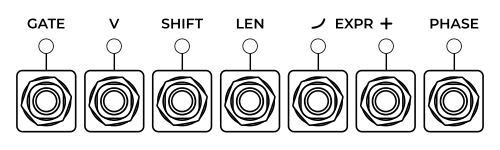

<!---
start: simple
-->

# Phaseque

  

> Phase-Driven Sequencer

Phaseque is a sequencer initially developed with two ideas in mind - solve some problems related to classical sequencers and create something new. For example, it's a common situation when composer realizes that start of a sequence is not at 1st step of sequencer - in such case Phaseque allows to easily shift pattern to desired position. Apart from that it provide many onther interesting things which are unusual for common sequencers.

## Quickstart

To let Phaseque play it should be fed with one of three variants of transport information - Classic Clock (triggers or pulse), Phase (sawtooth in range of 0V - 10V) or V/BPS. If [CLTCH](#controls-cltch) is active it starts to drive sequence with active transport info:

When clutch is enabled the [GATE](#outputs-gate) become active. All other outputs with sequence info works regardless of clutch state, including [V](#outputs-v) which is analogue of pitch from all other sequencers:

## Drivetrain Section

As said before, Phaseque supports different types of transport information, but its main feature is support of inter-beat positions.

### Classic Pulse Clock

In this mode Phaseque tries to detect tempo of triggers/pulse sent to the [CLOCK](#inputs-clock) input, but only if [Auto Sync](#controls-auto-sync) is enabled. In case it's disabled, Phaseque will play segment of a pattern with pre-selected tempo and then it will wait for the next pulse. This tempo can be adjusted with [knob](#controls-bpm) and can be overridden by [V/BPS](#inputs-vbps) input.

### V/BPS

[V/BPS](#inputs-vbps) input which was mentioned above also can be used to turn sequencer in motion. V/BPS is an absolute value, it means "volts per beat per second", e.g. 2 volts = 2 beats per second = 120 beats per minute. You can read a bit more about this idea in [Clock module documentation](./clock).

### Phase Clock

Phase clock is a most demonstrative transport mode of Phaseque. Range of [PHASE](#inputs-phase) input is from 0V to 10V. For usual tasks a sawtooth waveform can be used, every cycle of it will make sequencer to move trough another segment of its pattern. These segments are rendered at top of main display:

#### Absolute Mode

When using phase input the absolute phase mode becomes useful for direct control over position in sequence. It can be turned on by [ABS](#controls-abs) button. In this mode only one phase period is scaled over the all pattern and phase-wrap detection mechanics are disabled, so you can directly control where pattern playhead is located by changing value in [PHASE](#inputs-phase) input. In abosolute mode it's even possible to make Phaseque work as a sawtooth VCO processor or function generator.

### Pattern Resolution

Each of 32 patterns inside Phaseque has its own resolution (RESO), which is displayed at [reso display](#indicators-resolution) and can be adjusted with [encoder](#controls-resolution). Pattern resolution sets the amount of phase cycles required to play it from start to end. For example, it allows to create complex rhythmical patterns by using combinations of several patterns with different resolutions and allows to change the speed of sequencer without changing the speed of main clock.

### Clutch and Reset

The incoming transport and pattern playback are not hard-coupled in Phaseque, its possible to disable [CLTCH](#controls-clutch) and pause pattern playback. Also [GATE](#outputs-gate) is disabled when there is no clutch. The [RESET](#controls-reset) button resets phase to starting position which can be adjusted with the [MANUAL](#controls-manual) encoder.

## Pattern grid navigation

Phaseque has memory of 32 patterns and many ways to switch and detect switches between these patterns. On the grid the non-empty patterns are having slight highlighting, current pattern highlighted stronger and the next *planned* pattern has bright stroke around its number (we will talk about *planned* patterns later).

On the left from pattern grid the abosolute navigation section is located, at the bottom are inputs for relative navigation and on the right are outputs with information about pattern playback progress.

### Absolute navigation

The [V/12P](#inputs-v12p) input works similar to common V/OCT inputs but difference is that instead of musical notes there are pattern numbers. Each 1/12 of Volt equals 1 pattern. An impulse sent to the [GOTO](#inputs-goto) input will make sequencer switch to the pattern number which corresponds to voltage on [V/12P](#inputs-v12p) input.

>When [V/12P](#inputs-v12p) input is not connected the sequencer will always switch to the 1st pattern when receiving pulse on [GOTO](#inputs-goto) input.

Following these absolute navigation mechanics there are also the [WENT](#outputs-went) and [V/12P](#outputs-v12p) outputs which are signalling about pattern switching.

>By using abosolute navigation inputs and outputs it's possible to connect multiple Phaseque instances with each other and sync their pattern navigation.

### Relative navigation

All the relative navigation inputs are switching only between the non-empty patterns, e.g. ignoring the patterns without any changes made to them. The only exception is [SEQ](#inputs-seq) input.

The [PREV](#inputs-prev) and [NEXT](#inputs-next) inputs will navigate to the higher or lower number of pattern. If there is no non-empty pattern in the desired direction they will go around.

The [←](#inputs-left), [↓](#inputs-down), [↑](#inputs-up), [→](#inputs-right) are inputs for 2D navigation. Like the two inputs mentioned above they switch only to the nearest non-empty pattern in the corresponding direction. The area in which these inputs operate is divided into 2 squares and the right square is really an upper continuation of left square, so it's a 4x8 rectangle. The easiest way to get familiar with those controls is to fill all the patterns with some sequences (right click on Phaseque -> "Randomize All Patterns") and try sending the pulses to each of them (one by one).

The [SEQ](#inputs-seq) input is for going to the *planned* pattern. Each pattern in the grid can have its successor, e.g. the pattern which will follow it when sequencer receives pulse on the [SEQ](#inputs-seq) input. The *planned* pattern can be choosen by right-clicking on the grid.

[RND](#inputs-rnd) - switch to random non-empty pattern.

[WAIT](#controls-wait) - the pattern navigation block. Useful to stop the sequencer walking over the patterns to eliminate unwanted corruption of them when editing the current pattern.

<!---
end: simple
-->
