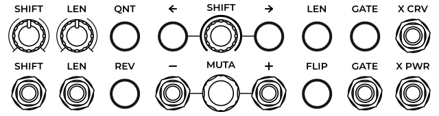

<!---
start: simple
-->

# Phaseque

  

> Секвенсор, управляемый фазой

Phaseque - это секвенсор, который изначально разрабатывался с двумя идеями - решить проблемы, вызванные ограничениями классических секвенсоров и добавить что-нибудь интересное. Например, часто бывает так, что при создании секвенции вдруг становится ясно, что сильная доля оказалсь не на первом шаге паттерна, Phaseque легко позволяет сместить весь паттерн по фазе на необходимую величину. Помимо этого он позволяет делать ещё много других вещей, необычных для большинства секвенсоров.

## Быстрый старт

Чтобы заставить Phaseque играть, ему нужно дать один из трёх вариантов информации о транспорте в вашем проекте - классический клок (импульсы), фазу (пила в диапазоне 0V - 10V) или V/BPS и включить сцепление ([CLTCH](#controls-cltch)):

Когда сцепление включено, выход [Gate](#outputs-gate) становится активным. Остальные выходы с информацией о шагах секвенции работают постоянно, в том числе, выход [V](#outputs-v), являющийся аналогом питча в классических секвенсорах:

## Секция привода

Как было сказано выше, Phaseque поддерживает разные виды информации о транспорте, но его основная особенность в поддержке положения транспорта между ударами долей.

### Классический импульсный клок

В этом режиме Phaseque пытается подстроиться под темп импульсов, поступающих на вход [Clock](#inputs-clock) если включена [автоподстройка](#controls-auto-sync). Если же она отключена, то он будет проигрывать часть паттерна с заданным темпом, а потом дожидаться следующего импульса. Этот темп задаётся при помощи [регулятора](#controls-bpm) и может быть переопределён при помощи входа [V/BPS](#inputs-vbps).

### V/BPS

Упомянутый выше вход [V/BPS](#inputs-vbps) так же может использоваться для привода секвенсора в движение. V/BPS это абсолютное значение, вольты на удары в секунду, то есть, 2 вольта - это темп два удара в секунду (или 120 BPM). Немного больше об этом написано в [руководстве модуля Clock](./clock).

### Фазовый клок

Фазовый транспорт является самым наглядным в Phaseque. Диапазон входа [PHASE](#inputs-phase) - от 0V до 10V. Для обычной работы в качестве сигнала с фазой выступает пилообразная волна, каждый период которой заставляет секвенсор пройти через очередную фазу паттерна. Эти участки обозначены на главном дисплее:

#### Абсолютный режим

При использовании входа фазы становится полезным режим абсолютной фазы включаемый переключателем [ABS](#controls-abs). В этом режиме один период растягивается на весь паттерн, отключаются механизмы угадывания истинной фазы транспорта и секвенсор встаёт ровно в то место паттерна, которое соответствует текущему значению на входе [PHASE](#inputs-phase). В абсолютном режиме Phaseque можно превратить в надстройку над пилообразным VCO.

### Разрешение паттерна

Каждый паттерн в Phaseque (а их в нём может храниться 32 штуки) имеет собственное разрешение (Resolution, "Reso"), отображаемое на [дисплее](#indicators-resolution) и регулируемое [энкодером](#controls-resolution). С помощью разрешения можно указать, с какой скоростью проигрывается паттерн - чем больше разрешение, тем больше импульсов клока или периодов фазы нужно, чтобы проиграть его от начала до конца. Можно легко создавать необычные ритмические рисунки, используя комбинации из нескольких паттернов с разными разрешениями, сумма которых составляет желаемую протяжённость комбинации.

### Сцепление и сброс

Привод и проигрывание паттерна в Phaseque не связаны жёстко, в любой момент можно отключить сцепление ([CLTCH](#controls-clutch)) и проигрывание паттерна прекратится, а так же отключится выход [GATE](#outputs-gate). Кнопка [RESET](#controls-reset) производит сброс паттерна к стартовой позиции, которая может быть отрегулирована при помощи энкодера [MANUAL](#controls-manual).

## Навигация по сетке паттернов

Phaseque имеет память на 32 паттерна и широкие возможности по переключению между ними и отслеживанию этих переключений. На сетке не пустые паттерны отмечаются слабой подстветкой, текущий паттерн - яркой подстветкой, а запланированный паттерн имеет яркую обводку (об этом чуть позже). Слева от сетки паттернов находится секция абсолютной навигации, снизу - ряд входов относительной навигации и справа - выходы с информацией о перемещении по паттерну и переключении между ними.

### Абсолютная навигация

Вход [V/12P](#inputs-v12p) работает по аналогии с CV входами, предназначенными для выражения музыкальных нот с помощью CV, но здесь вместо нот - номера паттернов. Каждое повышение напряжения на 1/12 вольта эквивалентно 1 паттерну. Вход [GOTO](#inputs-goto) принимает импульсы, которые заставляют секвенсор переключиться на паттерн, соответствующий текущему напряжению на входе [V/12P](#inputs-v12p).

>Если вход [V/12P](#inputs-v12p) не подключен, то триггеры на входе [GOTO](#inputs-goto) будут возвращать секвенсор на первый паттерн.

По аналогии со входом [V/12P](#inputs-v12p), выход [V/12P](#outputs-v12p) сообщает о номере текущего паттерна, а выход [WENT](#outputs-went) сигнализирует в виде триггера о произошедшем переходе секвенсора на этот паттерн.

>С помощью входов и выходов абсолютной навигации можно соединять несколько модулей Phaseque друг с другом и синхронизировать их переходы между паттернами.

### Относительная навигация

Все входы относительной навигации переключаются только между не пустыми паттернами, то есть, игнорируя те паттерны, в которых не было сделано никаких изменений. Исключением является вход [SEQ](#inputs-seq).

[PREV](#inputs-prev) и [NEXT](#inputs-next) переходят к предыдущему или следующему по порядку номеров паттерну. Если в выбранном направлении больше нет не пустых паттернов, то поиск цели происходит по кругу.

[←](#inputs-left), [↓](#inputs-down), [↑](#inputs-up), [→](#inputs-right) - входы для перемещения по сетке в определённом направлении. Как и два предыдущих входа, они переключают секвенсор только на ближайший не пустой паттерн в выбранном направлении. При этом сетка паттернов разделена на два квадрата и правый квадрат является продолжением верхней части левого квадрата. То есть, если начать переключаться вправо с первого паттерна, то порядок будет таким: 1 → 2 → 3 → 4 → 1, а если начать переключаться вверх, то 1 ↑ 5 ↑ 9 ↑ 13 ↑ 17 ↑ 21 ↑ 25 ↑ 29 ↑ 1.

[SEQ](#inputs-seq) - переход на запланированный паттерн. Для каждого паттерна в сетке можно запланировать следующий паттерн, на который секвенсор переключится при получении триггера на входе [SEQ](#inputs-seq). Это можно сделать кликом правой кнопкой мыши по сетке паттернов.

[RND](#inputs-rnd) - переход на случайный не пустой паттерн.

[WAIT](#controls-wait) - блокировка переключения паттернов. Может применяться в процессе редактирования паттерна, чтобы не повредить соседние паттерны при неожиданном переключении секвенсора на них.

### Информация о навигации

Phaseque сообщает о прогрессе воспроизведения текущего паттерна.
* Он выдаёт текущую фазу на выходе [PHASE](#outputs-pattern-phase).
* Он генерирует триггер на выходах [END](#outputs-end) и [START](#outputs-start) когда паттерн доиграв до конца или начала (в случае реверса) начинает проигрываться заново. Выход [WRAP](#outputs-wrap) выдаёт триггер как в первом, так и во втором случае.

## Трансформация паттерна

Над паттернами в Phaseque можно производить различные деструктивные и недеструктивные трансформации.

Регуляторы [SHIFT](#controls-global-shift) и [LEN](#controls-global-len) позволяют динамически регулировать сдвиг по фазе и длину шагов паттерна с возможностью управления через CV. Сдвиг регулируется в пределах +/- 1/8 от длины паттерна при помощи регулятора и ещё на столько же при помощи CV. Длина шагов может быть увеличена максимум в 2 раза при помощи регулятора [LEN](#controls-global-len) и ещё в 2 раза при помощи CV.

Кнопки [QNT](#controls-pattern-qnt) и [LEN](#controls-pattern-len) производят квантизацию старта и длины шагов к сетке размерностью 1/16 от длины паттерна.

Кнопки [REV](#controls-pattern-rev) и [FLIP](#controls-pattern-flip) переворачивают паттерн по горизонтали или вертикали.

Блок [SHIFT](#controls-pattern-shift) позволяет отрегулировать сдвиг каждого паттерна отдельно от всех остальных.

Кнопка [GATE](#controls-global-gate) позволяет инвертировать состояние гейтов у шагов, если её выключить. В свою очередь, соответствующий ей CV вход [GATE](#inputs-global-gate) позволяет инвертировать её состояние.

Напряжение на входах [X CRV](#inputs-global-x-crv) и [X PWR](#inputs-global-x-pwr) глобально регулирует кривость огибающих экспрессий и параметр степени используемый для построения кривых.

### Мутации паттерна

Одна из уникальных функций Phaseque - возможность мутировать шаги паттерна. При мутации все скалярные характеристики шагов в активном паттерне смещаются по определённому вектору. С каждой последующей мутацией вектор для каждой из характеристик может плавно изменяться. При этом оригинальные аттрибуты шагов сохраняются неизменными и к ним можно вернуться убавив мутацию. Мутация плавно регулируется регулятором [MUTA](#controls-pattern-muta) или ступенчато отправкой триггеров на входы [-](#controls-pattern-muta-dec) и [+](#controls-pattern-muta-inc). При отправке отрицательного триггера на вход [-](#controls-pattern-muta-dec) мутация сбрасывается полностью. Входы [-](#controls-pattern-muta-dec) и [+](#controls-pattern-muta-inc) поддерживают полифонию, что позволяет управлять мутацией шагов по отдельности.

## Основные выходы и полифония

Основные выходы секвенсора могут работать в монофоническом режиме, 8-голосном полифоническом и 16-голосном полифоническом. В 8-голосном полифоническом режиме каждый шаг паттерна занимает свой постоянный голосовой канал от 1 до 8, это объясняет то, что сигнал на таких выходах, как [V](#outputs-v), [SHIFT](#outputs-shift), [LEN](#outputs-len) и [EXPR +](#outputs-expr-curvature) может выглядеть статично, не смотря на то, что секвенсор находится в движении. При работе секвенсора в 16-голосном полифоническом режиме каналы с 1 по 8 выводят базовые параметры шагов (без мутаций), при этом добавляются ещё 8 каналов (9-16), где выводятся параметры шагов с применённой мутацией.

Помимо параметров [GATE](#outputs-gate) и [V](#outputs-v), свойственным всем обычным секвенсорам, присутствуют дополнительные параметры:
* [SHIFT](#outputs-shift) - отображает смещение старта шага относительно его стандартной позиции в диапазоне +/- 1/8 от длины паттерна, что эквивалентно +/- 5 Вольтам на выходе.
* [LEN](#outputs-shift) - аналогично выходу [SHIFT](#outputs-shift) отображает отличие выставленной длины шага от стандартной длины шага, равной 1/8 длины паттерна.
* [EXPR](#outputs-expr) - пара выходов, первый из которых выводит кривую экспрессии в диапазоне от -5 до +5 Вольт, а второй характеризует полярность, по направлению к которой прогнута эта кривая.
* [PHASE](#outputs-phase) - фаза текущего шага в диапазоне от 0 до 10 Вольт.

## Прыжки между шагами

Входы в строке [JMP](#inputs-jmp) при получении импульсов заставляют секвенсор мгновенно переместиться к соответствующему шагу. Триггеры на входе [RND](#inputs-rnd) совершают прыжок к случайному шагу. Персональные выходы [GATE](#outputs-step-gate) сообщают об активности каждого шага отдельно. Вся эта группа входов и выходов позволяет создавать сложные секвенции перенаправляя сигналы с выходов [GATE](#outputs-step-gate) на входы [JMP](#inputs-jmp) используя различную логику (например, вероятность из [Bernoulli Gate](https://mutable-instruments.net/modules/branches/)).

>Создание документации находится в процессе. Пожалуйста, если у вас есть вопросы, не стесняйтесь создать Issue в свободной форме в [основном репозитории ZZC](https://github.com/zezic/ZZC/issues/new), так вы сможете помочь не только себе, но и другим пользователям с похожими вопросами. Так же вы можете отправить письмо на адрес [zezic51@yandex.ru](mailto:zezic51@yandex.ru)

<!---
end: simple
-->

<!---
start: affixing
affixed: blueprint
blueprint: phaseque-blueprint.svg
preview: phaseque.svg
blueprint-offset: 0
blueprint-crop: 335
-->

## Секция транспорта

<!---
start: legend
-->

<!---
start: legend-group
slug: inputs
-->

### Входы

* <!---
  x: 10
  y: 52
  slug: vbps
  type: labeled-socket
  -->
  <a name="inputs-vbps" href='#inputs-vbps'>V/BPS</a> - вольты на бит на секунду. Напряжение на входе регулирует текущий темп модуля, каждый вольт прибавляет 60 BPM к текущему значению. Поддерживаются отрицательные значения, они могут заставить работать генератор в обратную сторону (реверс).

<!---
end: legend-group
-->

<!---
end: legend
-->

<!---
end: affixing
-->
